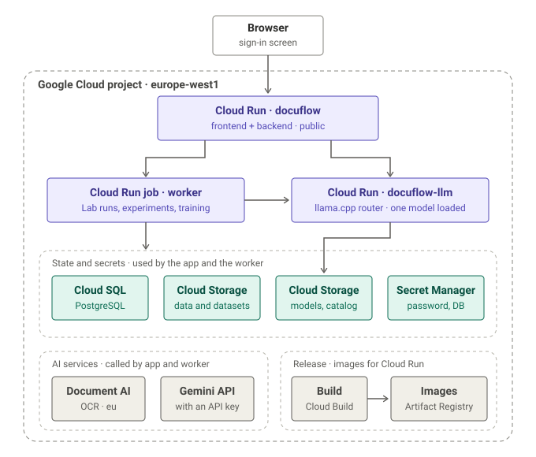
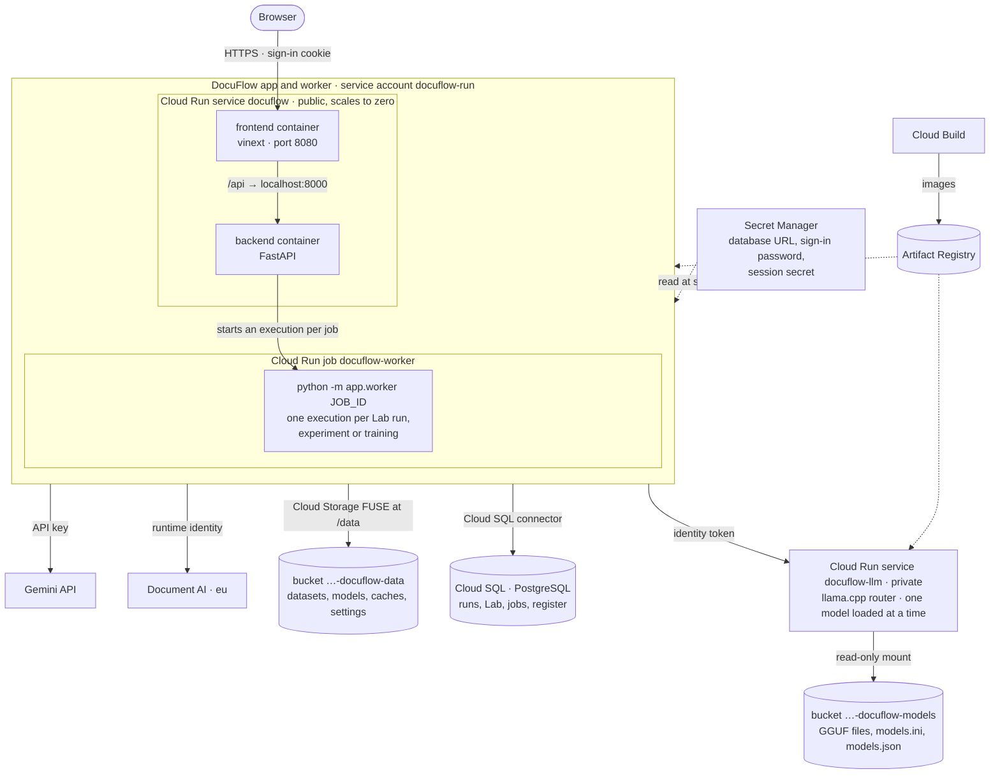

# Deployment and cloud portability

DocuFlow runs on a developer machine, and on Google Cloud from the `cloud`
branch. It is meant to run on more than one cloud without depending on any one
of them. This page is the contract that keeps that true, how the Google Cloud
deployment is built, and the list of what still stands in the way.

## Principles

1. **One image, configured by the environment.** The backend and frontend are
   plain OCI images (`deploy/`). Nothing in them names a cloud; storage, the
   database, sign-in, where long work runs and which model server answers come
   from `DOCUFLOW_*` variables. Unset, everything behaves as on a developer
   machine.
2. **Every external service behind one module.** A provider is an adapter
   behind an interface ([architecture](architecture.md#where-vendor-specific-code-lives)).
   Callers never import a cloud SDK directly.
3. **Managed services are a choice per deployment, not a dependency of the
   code.** Google Document AI and Gemini are providers DocuFlow can use, the way
   LM Studio is; using them on GCP is natural, and the same pipeline vocabulary
   must be able to name an alternative elsewhere.
4. **State is portable data.** Models are JSON and arrays, datasets are PDFs and
   JSON labels, the database is SQL. Nothing is a pickle or a provider-specific
   format a move would strand.

## Configuration

The backend reads these (`backend/app/config.py`); the frontend the last two.

| Variable | Default | Meaning |
|---|---|---|
| `DOCUFLOW_DATA_DIR` | `backend/data` | Settings, datasets, models, caches, and the SQLite file |
| `DOCUFLOW_DATABASE_URL` | unset: SQLite in the data folder | `postgresql://…` to keep the tables in PostgreSQL |
| `DOCUFLOW_CORS_ORIGINS` | `http://localhost:3000,http://127.0.0.1:3000` | Origins allowed to call the API directly |
| `DOCUFLOW_GCP_CREDENTIALS` | `<data dir>/gcp-service-account.json` | Document AI service-account key |
| `DOCUFLOW_GCP_RUNTIME_IDENTITY` | `false` | `true`: call Google APIs as the platform's identity for the container, with no key file |
| `DOCUFLOW_LOGIN_USER`, `DOCUFLOW_LOGIN_PASSWORD` | unset: no sign-in | The one account the sign-in screen accepts |
| `DOCUFLOW_SESSION_SECRET` | random per process | Signs the sign-in cookie |
| `DOCUFLOW_JOBS` | `in_process` | `cloud_run`: Lab runs, experiments and training run as Cloud Run job executions |
| `DOCUFLOW_JOBS_CLOUD_RUN_JOB` | — | With `cloud_run`: `projects/<p>/locations/<r>/jobs/<name>` |
| `DOCUFLOW_LM_STUDIO` | `on` | `off` where no LM Studio runs: LLM shows the model server instead, and nothing reports LM Studio missing |
| `DOCUFLOW_MODEL_SERVER_URL` | unset | An OpenAI-compatible model server (llama.cpp, vLLM, Ollama…) |
| `DOCUFLOW_MODEL_SERVER_AUTH`, `DOCUFLOW_MODEL_SERVER_TOKEN` | `none` | `bearer` with a token, or `google_id_token` for a private Cloud Run service |
| `DOCUFLOW_MODEL_SERVER_CATALOG` | unset | A JSON file describing the server's models: parameters, quantization, size, vision |
| `PORT` | `8000` backend, `3000` frontend | Port inside the container |
| `NEXT_PUBLIC_API_URL` | `http://127.0.0.1:8000` | API address the browser calls, fixed at frontend build time; `/` for the page's own origin |
| `DOCUFLOW_API_URL` | unset | Read by the frontend server at run time: where to forward `/api` when built with `/` |

## Long work runs as jobs

A Lab run, an experiment, a training run and a fine-tuning export are each a
row in the `jobs` table (`backend/app/jobs/`): what to do, how far it got,
whether someone asked it to stop. The API records the row and returns at once;
the work is done by the API process itself (`in_process`, the default) or by a
worker container started for it (`cloud_run`: `python -m app.worker <id>` in a
Cloud Run job execution). Either way it reports progress into the row and the
run's own tables, and Cancel reaches it through the row. Another platform's
batch service is another class in `jobs/queue.py` with the same two methods.
Why this shape: [0007](decisions/0007-long-work-as-recorded-jobs.md).

## Running the containers

```bash
docker compose up --build
```

The backend keeps its state on the `docuflow-data` volume. LM Studio stays on
the host: in **LLM**, set its URL to `http://host.docker.internal:1234`. CI
builds both images and starts them on every push.

## Google Cloud

Everything for a Google Cloud target lives in `deploy/gcp/`, driven by one env
file per target (`personal.env` is the first; a company project is a copy with
other values). The scripts name nothing else.

```bash
LOGIN_PASSWORD=... deploy/gcp/provision.sh deploy/gcp/personal.env   # resources, once
deploy/gcp/upload-models.sh deploy/gcp/personal.env ~/.lmstudio/models  # models, when the list changes
deploy/gcp/deploy.sh deploy/gcp/personal.env                          # build and deploy
PYTHON=python3 deploy/gcp/migrate-data.sh deploy/gcp/personal.env backend/data  # once
```



The same deployment with every connection named:



The app and the worker are the same backend image with the same
configuration; they differ only in what they run. Everything runs as one of
three service accounts and none of them has a downloaded key: `docuflow-run`
(the app and the worker), `docuflow-llm` (the model server, which reads only
the models bucket) and `docuflow-build` (Cloud Build).

| Resource | What it is for |
|---|---|
| Cloud Run service `docuflow` | The app: frontend and backend as two containers of one service, one public origin, billed per request, scales to zero |
| Cloud Run job `docuflow-worker` | Lab runs, experiments, training: one execution per job, billed while it runs |
| Cloud Run service `docuflow-llm` | llama.cpp in router mode over every model in the models bucket, one loaded at a time, on CPUs; private, called with the app's identity |
| Cloud SQL for PostgreSQL `docuflow-pg` | Runs, Lab results, experiments, jobs, register and rules; reached through the Cloud SQL connector only |
| Bucket `…-docuflow-data` | The data folder, mounted at `/data` with Cloud Storage FUSE |
| Bucket `…-docuflow-models` | The GGUF files, the router's presets (`models.ini`) and the catalog DocuFlow shows (`models.json`); read by the model server, and by the app and worker for the catalog |
| Artifact Registry `docuflow` | The images, built by Cloud Build from `deploy/*.Dockerfile` |
| Secret Manager | Database address, sign-in password, session secret |
| Service accounts `docuflow-run`, `-llm`, `-build` | The app and worker; the model server; the image build. No keys are downloaded |
| Budget | A monthly budget with alerts on the project; it warns, it does not stop spending |

LM Studio is switched off in this deployment (`DOCUFLOW_LM_STUDIO=off`). In
its place the model server works the way LM Studio does on a developer
machine: the LLM section's *Self-hosted* tab lists every model in the bucket
with whether it is loaded, and **Load & warm up** has the server load the
selected one — unloading the previous — and warms it, so loading is timed
apart from any document. An experiment loads each of its models once, in turn.

The models are listed in the env file (`LLM_MODELS`: id, model file,
projector file for vision, parameters). `upload-models.sh` copies each file
from a local folder — LM Studio's, say — to the models bucket and writes the
router's presets and the catalog beside them. Adding a model is a line in the
env file and a run of that script; no redeploy. The service is sized for the
largest model (`LLM_MEMORY`; 32 GiB is the most a Cloud Run instance without a
GPU can have).

The browser reaches one address: the frontend container answers it and
forwards `/api` to the backend beside it (`app/api/[...path]/route.ts`), so
the sign-in cookie covers every request, PDF previews and downloads included,
and the backend is not exposed. Document AI is called as `docuflow-run`, with
no key file. The data migration copies the files to the bucket and the SQLite
history into Cloud SQL from inside a worker execution; it leaves the Gemini key
and the service-account key behind.

What to know when using it:

- **Sign-in is one shared account**, meant for a short demo. Change the
  password with `LOGIN_PASSWORD=... provision.sh` and redeploy, and remove it
  once DocuFlow has real users.
- **The data folder is a bucket.** Cloud Storage FUSE has no file locking and
  the last write of a file wins. One app instance, one Lab job and one training
  job at a time (all enforced) keep that safe, since they write different
  files; a storage interface removes the limit.
- **The model server scales to zero, and forgets its model when it does.**
  After a pause LLM shows the model as not loaded; Load & warm up loads it
  again, which takes longest for the largest model, read from the bucket. While
  an instance is up, CPU stays allocated so a load can finish between
  requests. The CPU answers more slowly than a GPU would; the Lab measures it.

## Mapping onto other clouds

The same images; each platform supplies a container runtime, a database, a
volume or bucket for the data folder, a secret store, and a batch runner for
jobs.

| Need | Google Cloud (deployed) | AWS | Azure |
|---|---|---|---|
| Run the containers | Cloud Run | ECS on Fargate or EKS | Container Apps or AKS |
| Long work | Cloud Run jobs | AWS Batch or ECS tasks | Container Apps jobs |
| Database | Cloud SQL for PostgreSQL | RDS for PostgreSQL | Azure Database for PostgreSQL |
| Data folder | Cloud Storage FUSE | Mountpoint for S3 or EFS | Blob NFS or Azure Files |
| Secrets | Secret Manager | Secrets Manager | Key Vault |
| Restricting access | Sign-in in the app; IAP for a real perimeter | ALB with OIDC / Cognito | Easy Auth / Entra ID |
| Self-hosted models | llama.cpp on Cloud Run (GPU optional) | ECS/EKS with vLLM or llama.cpp | Container Apps with vLLM or llama.cpp |
| Hosted language models | Gemini (API or Vertex AI) | Bedrock | Azure OpenAI |
| OCR and layout | Document AI | Textract | Document Intelligence |

## What is not portable yet

Honest gaps, in the order the next deployment would meet them. Each is a seam
to cut, not a rewrite.

1. **One shared account.** Sign-in keeps a demo URL from being used by
   whoever finds it; it is not users, roles or an audit trail. A deployment
   for a team sits behind the platform's identity-aware access until DocuFlow
   has users.
2. **Files on a file system.** Datasets, evaluation inputs, models and caches
   are files under the data folder, which on Google Cloud is a FUSE-mounted
   bucket. A storage interface over local files and object storage (GCS, S3,
   Blob) would drop the mount and its one-writer limit.
3. **Vendor names in the pipeline vocabulary.** Step kinds such as
   `document_ai_ocr` name Google. Generic reader kinds (`ocr`, `layout`,
   `field_extractor`) bound to a provider in the processor catalog would let one
   pipeline run on Textract or Document Intelligence; existing pipelines would
   migrate by mapping the old kinds.
4. **One job runner per cloud.** In process and Cloud Run jobs exist; AWS Batch
   or Container Apps jobs are a class each in `backend/app/jobs/queue.py`.
5. **The frontend's API address is fixed at build time.** `/` (same origin)
   makes one frontend image serve every deployment that forwards `/api`; a
   frontend calling an API elsewhere still needs its own build.

The order to tackle them is in the [roadmap](../ROADMAP.md#cloud-deployment).
